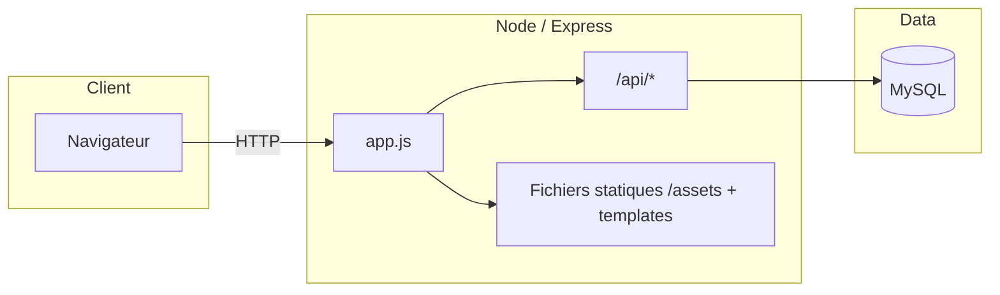

<p align="center">
  
</p>

<h1 align="center">Yblazing Fail — BoutiqueJS</h1>

<p align="center">
  <strong>Boutique en ligne de cartes à collectionner</strong> · Pokémon TCG · Yu-Gi-Oh!<br/>
  Projet full-stack : API Express, MySQL, frontend HTML/CSS/JS — prêt pour le déploiement (Railway & co.)
</p>

<p align="center">
  
  
  
  
</p>

<p align="center">
  <a href="#-fonctionnalités">Fonctionnalités</a> ·
  <a href="#-stack-technique">Stack</a> ·
  <a href="#-installation">Installation</a> ·
  <a href="#-api">API</a> ·
  <a href="#-structure-du-projet">Structure</a> ·
  <a href="#readme-credits">Crédits</a>
</p>

---

## Pourquoi ce projet ?

**Yblazing Fail**, c’est une vitrine e-commerce pensée comme une vraie boutique spécialisée : navigation par univers (Pokémon / Yu-Gi-Oh!), fiches produit soignées, panier persistant, recherche, favoris, promotions et parcours jusqu’au paiement (maquette).  
Le tout avec une identité visuelle forte (palette teal / jaune / rouge), des pages CGV type « contrat de duel », et un responsive qui tient la route sur mobile.

---

## Fonctionnalités

| Zone | Détail |
|------|--------|
| Catalogue | Liste des produits, filtres par thème/licence, catégories |
| Fiche article | Galerie, infos (langue, édition, licence, état), quantité, ajout panier |
| Panier | Stockage local, bulle sur le header, mise à jour des quantités |
| Favoris | Liste basée sur `localStorage`, cœur sur les cartes |
| Recherche | Requête GET + API `/api/products/search/:name` |
| Promotions | Produits en promo |
| Pages infos | Qui sommes-nous, Contact, **CGV** avec sommaire interactif et accordéon |
| Paiement | Parcours formulaire + confirmation (démo) |
| Déploiement | Config MySQL compatible **Railway** (`MYSQL_URL`, variables `MYSQL*`…) |

---

## Stack technique

- **Backend** : [Express](https://expressjs.com/) 4.x, [mysql2](https://github.com/sidorares/node-mysql2) (pool), CORS  
- **Base** : MySQL (schéma type e-commerce : produits, catégories, licences, etc.)  
- **Frontend** : HTML5, CSS3 (variables, grid, responsive), JavaScript ES6+ (fetch, `localStorage`, pas de framework imposé)  
- **Outils** : Node ≥ 18, scripts npm à la racine et dans `backend/`

---

## Architecture (aperçu)



---

## Installation

### Prérequis

- [Node.js](https://nodejs.org/) **≥ 18**
- **MySQL** en local (ou URL distante type Railway)
- Un client MySQL ou import du script SQL du dossier `frontend/assets/sql/` si fourni

### Étapes

```bash
# Cloner le dépôt (remplace par ton URL GitHub)
git clone https://github.com/<XERCORD>/<repo>.git
cd <repo>

# Dépendances backend (utilisées au démarrage depuis la racine)
cd backend && npm install && cd ..
```

Configurer la base (par défaut en local le code attend souvent une base du type `e_commerce_js` — voir `backend/config/database.js`).

### Variables d’environnement (MySQL)

Le pool lit notamment :

| Variable | Rôle |
|----------|------|
| `MYSQL_URL` ou `DATABASE_URL` | URL `mysql://...` complète (Railway, etc.) |
| `MYSQL_HOST` / `MYSQLHOST` | Hôte |
| `MYSQL_USER` / `MYSQLUSER` | Utilisateur |
| `MYSQL_PASSWORD` / `MYSQLPASSWORD` | Mot de passe |
| `MYSQL_DATABASE` / `MYSQLDATABASE` | Nom de la base |
| `MYSQL_PORT` / `MYSQLPORT` | Port (défaut `3306`) |

En local sans variables, fallback typique : `localhost`, utilisateur `root`, mot de passe vide, base `e_commerce_js` (à adapter à ta machine).

### Lancer le serveur

Depuis la **racine du projet** :

```bash
npm start
```

Puis ouvre : **http://localhost:3000**  
(Les pages HTML sont servies depuis `frontend/templates`, les assets depuis `/assets`.)

Alternative depuis `backend/` :

```bash
cd backend && npm run dev
```

(`nodemon` si installé en dev.)

---

## Scripts NPM

| Commande | Emplacement | Effet |
|----------|-------------|--------|
| `npm start` | Racine | Lance `node backend/app.js` |
| `npm start` | `backend/` | Idem |
| `npm run dev` | `backend/` | Développement avec rechargement (`nodemon`) |
| `npm run import-sql` | `backend/` | Script d’import de données (selon projet) |

---

## API (extraits)

Base URL : `/api`

| Méthode | Chemin | Description |
|---------|--------|-------------|
| GET | `/products` | Tous les produits |
| GET | `/products/:id` | Détail d’un produit |
| GET | `/products/search/:name` | Recherche par nom |
| GET | `/products/licence/:id` | Par licence |
| GET | `/products/categories/:id` | Par catégorie |
| GET | `/products/promotion` | Promotions |
| GET | `/categories` | Catégories |
| POST | `/update-stock` | Mise à jour de stock (parcours commande) |

---

## Structure du projet

```
BoutiqueJS/
├── backend/
│   ├── app.js              # Point d’entrée Express
│   ├── config/             # Connexion MySQL
│   ├── controllers/
│   ├── routes/
│   └── package.json
├── frontend/
│   ├── assets/
│   │   ├── css/            # Feuilles par page + header / responsive
│   │   ├── js/             # Logique (panier, API helpers, etc.)
│   │   └── img/
│   └── templates/          # Pages HTML
├── package.json            # Script start racine (déploiement)
└── README.md
```

---

## Déploiement

Le projet est pensé pour tourner sur une plateforme type **Railway** : une commande `npm start` à la racine, variables MySQL injectées, CORS activé, SSL MySQL géré quand `RAILWAY_ENVIRONMENT` est défini.

---

<a id="readme-credits"></a>

## Crédits & contexte

### Développeurs

- **XERCORD** — Full-stack : architecture du projet, API **Express**, base **MySQL**, intégration des pages et logique métier côté client et serveur.  
  [GitHub — @XERCORD](https://github.com/XERCORD)

- **Kottah** — Frontend : mise en page, styles, composants visuels et expérience utilisateur (HTML, CSS, JavaScript).  
  [GitHub — @Kottah02](https://github.com/Kottah02)

**Dépôt du projet :** [github.com/XERCORD/BoutiqueJS](https://github.com/XERCORD/BoutiqueJS)

### Contexte

Projet pédagogique **Bachelor 1 Informatique** — **Challenge JavaScript** — **Ynov Campus** · **Aix-en-Provence**.  
Identité fictive **Yblazing Fail** : boutique de cartes à collectionner (Pokémon TCG, Yu-Gi-Oh!).

---

## Licence

Projet académique — usage et licence à préciser selon ton établissement ou ta préférence (ISC côté `backend/package.json` pour le package npm).

---

<p align="center">
  <sub>Si ce README t’a aidé, une petite ⭐ sur le repo, c’est la carte rare qui complète la collection.</sub>
</p>
